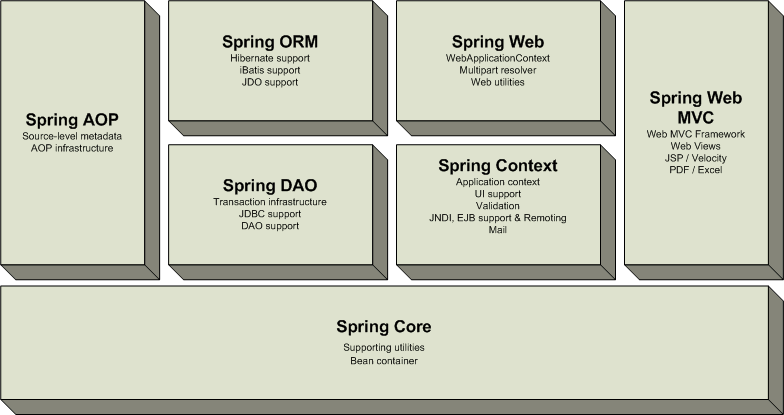

# 스프링 프레임워크 1.0 까보면서 좀 파악해보기

## 패키지들

---

- aop
- beans : 자바빈을 생성하기 위한 인터페이스와 클래스들을 포함한다
          다른 스프링 패키지들에서 가장 많이 사용하는 패키지 (작업중)
- context
- core : 예외 처리를 가능하게 하고, 프레임워크에 속하지 않는 핵심 인터페이스들을 제공하는 기본적인 클래스 (완료)
- dao
- ejb
- jdbc
- jndi
- mail 
- metadata
- orm
- remoting
- scheduling
- transaction
- ui
- util
- validation
- web

